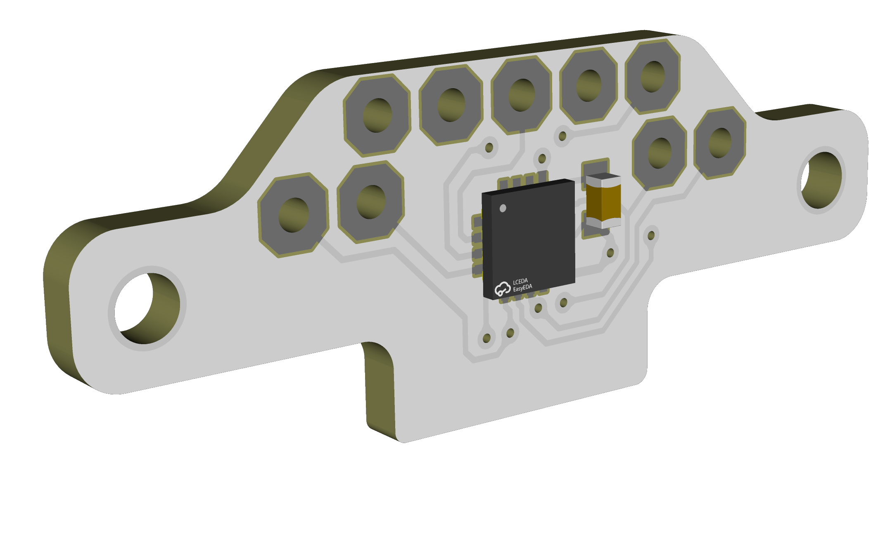

# TinyFOC_pro

  
 
 

* Compact brushless motor driver modified from [mit mini cheetah driver](https://github.com/bgkatz/3phase_integrated)
* 12 bit GMR-based encoder with MA710 or AS5047p
* CAN, hardware serial

Design file exported with [Autodesk EAGLE](https://www.autodesk.com/products/eagle/overview?term=1-YEAR&tab=subscription)

## License
MIT License

## Contact
* Shuang Peng, {shuangpe}@usc.edu
